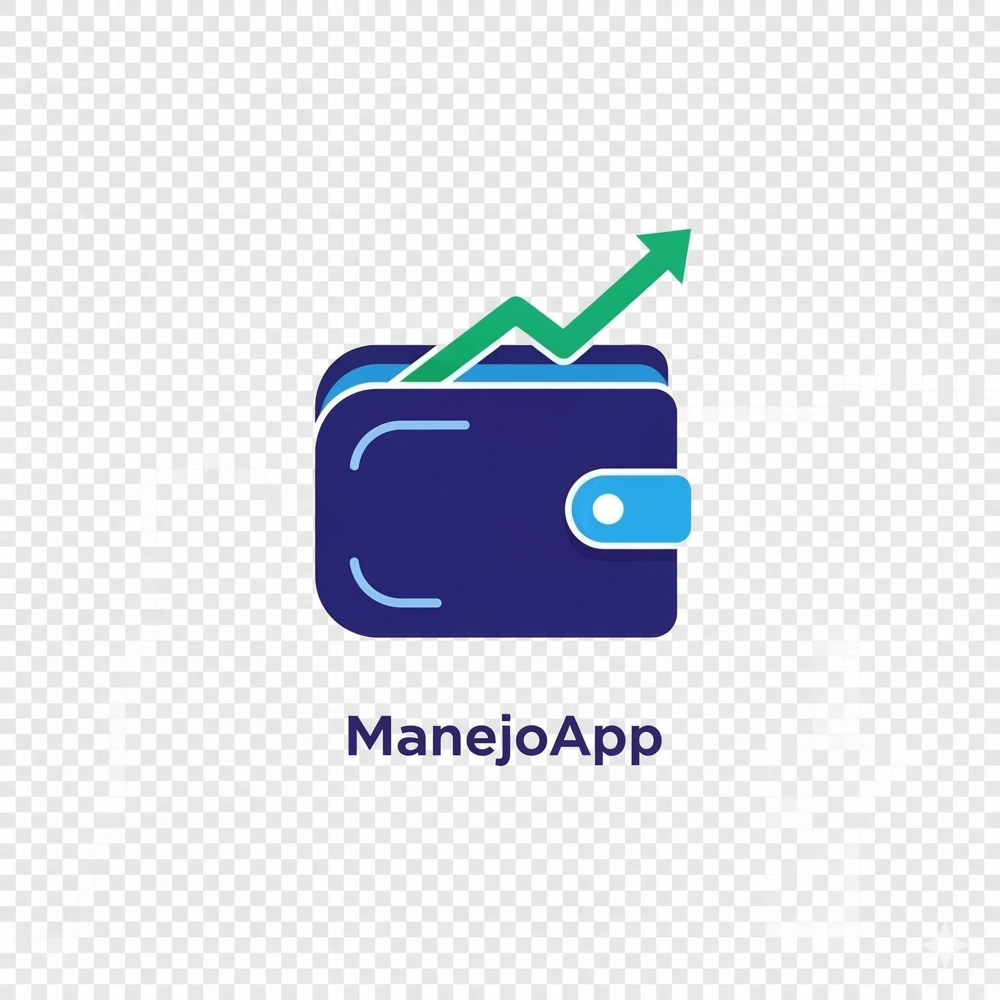

ManejoApp 📊

A integridade das suas contas, sob controle. Um SaaS de educação financeira projetado para organizar o seu dinheiro, gerir os seus gastos e mantê-lo longe de dívidas.

🎯 Sobre o Projeto

O ManejoApp nasceu com um propósito claro: trazer paz de espírito para a vida financeira. Mais do que uma simples planilha, é uma plataforma de educação financeira que aplica métodos comprovados (como a Regra 50-30-20) para ajudar o utilizador a visualizar os seus ralos financeiros, proteger o seu património e construir um futuro sem dívidas.

A aplicação conta com um design premium inspirado nas maiores Fintechs do mercado, oferecendo uma experiência de uso fluida, segura e totalmente focada no utilizador.

✨ Funcionalidades Principais

🔐 Autenticação Segura: Login rápido e seguro via Google Account (Firebase Auth).

☁️ Cloud Sync: Os dados estão isolados e guardados em segurança na nuvem, acessíveis de qualquer dispositivo (Firestore).

🧪 Modo Sandbox: Ambiente de teste offline para novos utilizadores experimentarem a plataforma sem precisarem de criar conta.

📈 Análise Inteligente: Gráficos interativos que mostram exatamente a percentagem gasta em Despesas Essenciais, Estilo de Vida e Dívidas.

⬇️ Exportação de Dados: Possibilidade de descarregar todo o histórico em formato JSON para backups pessoais.

🧠 A Filosofia (Regra 50-30-20)

A plataforma incentiva ativamente o utilizador a dividir os seus rendimentos de forma saudável:

50% Essencial: (Moradia, Alimentação, Saúde).

30% Estilo de Vida: (Lazer, Subscrições).

20% Futuro: (Quitar dívidas ou criar reserva de emergência).

🚀 Como correr o projeto localmente

Siga os passos abaixo para testar a aplicação na sua própria máquina:

1. Clone o repositório e instale as dependências:

git clone [https://github.com/seu-usuario/manejo-financeiro.git](https://github.com/seu-usuario/manejo-financeiro.git)
cd manejo-financeiro
npm install

2. Configure as variáveis de ambiente (Firebase):
No ficheiro principal da aplicação (src/App.jsx), substitua as credenciais provisórias pelas chaves oficiais do seu projeto Firebase:

const firebaseConfig = {
  apiKey: "SUA_API_KEY",
  authDomain: "SEU_PROJETO.firebaseapp.com",
  projectId: "SEU_PROJETO"
};

3. Inicie o servidor de desenvolvimento:

npm run dev

A aplicação estará disponível em http://localhost:5173.

Feito com 💙 para transformar vidas financeiras.

