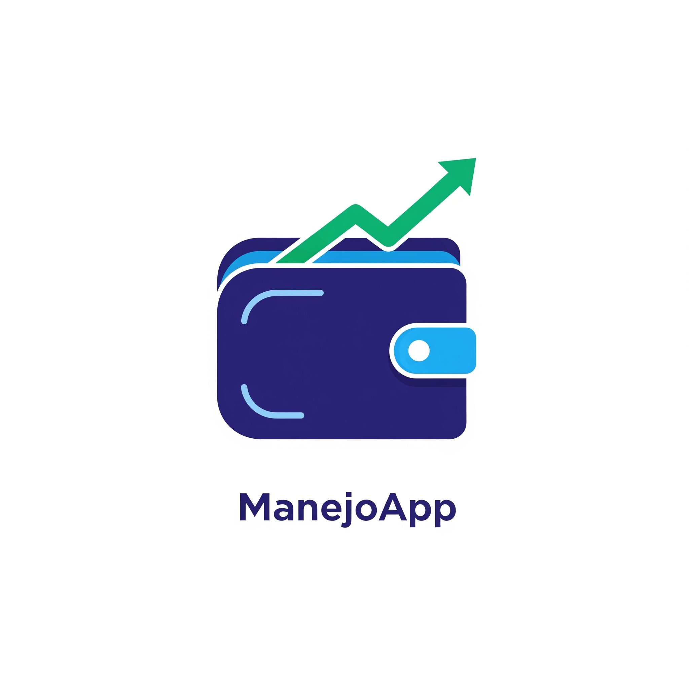

 

ManejoApp 🛡️ 💹

Liberdade financeira através de código aberto. Um gerenciador financeiro focado em privacidade, integridade de contas e na filosofia 50-30-20.

📖 Sobre o Projeto

O ManejoApp é um software livre desenvolvido para quebrar o ciclo das dívidas. Diferente de soluções proprietárias que vendem seus dados, o ManejoApp foi construído com a transparência em primeiro lugar.

Acreditamos que a soberania financeira deve ser acompanhada pela soberania tecnológica. Por isso, o código é aberto para auditoria, modificação e distribuição sob a licença GPL-3.0.

💡 A Filosofia de Controle

O app implementa nativamente a regra 50-30-20:

50% (Essencial): O que você precisa para sobreviver.

30% (Estilo de Vida): O que te traz alegria.

20% (Futuro): O caminho para a liberdade (reserva e quitação de débitos).

✨ Funcionalidades "Privacy-First"

🔐 Autenticação Descentralizada: Suporte a Google Auth e login tradicional por e-mail/senha.

📁 Data Sovereignty: Seus dados são isolados. Você pode exportar seu histórico em JSON a qualquer momento.

⚡ Performance Unix-Like: Interface leve, rápida e responsiva construída com Vite.

📊 Visualização Transparente: Gráficos interativos para identificar ralos financeiros instantaneamente.

🛠️ Stack Tecnológica

Frontend: React.js + Tailwind CSS.

Backend-as-a-Service: Firebase (Auth & Firestore).

Ícones: Lucide-React.

Build Tool: Vite.

🚀 Como Contribuir (Hacktoberfest Ready!)

Contribuições são o coração do software livre! Se você é um desenvolvedor, designer ou entusiasta de finanças, seu Pull Request é bem-vindo.

Fork o projeto.

Crie uma Branch para sua feature (git checkout -b feature/NovaFeature).

Faça o Commit das suas alterações (git commit -m 'feat: Adiciona nova funcionalidade').

Peça um Pull Request.

[!TIP]
Confira o nosso CONTRIBUTING.md para entender nossos padrões de código e design.

💻 Instalação para Desenvolvedores

Se você quer rodar sua própria instância ou modificar o código:

# Clone o repositório
git clone [https://github.com/gustavormartins/manejo-app.git](https://github.com/gustavormartins/manejo-app.git)

# Entre na pasta
cd manejo-app

# Instale as dependências (seguindo os peer-deps do Vite/Tailwind)
npm install --legacy-peer-deps

# Rode o ambiente de desenvolvimento
npm run dev

⚖️ Licença

Este projeto está licenciado sob a GNU General Public License v3.0 - consulte o arquivo LICENSE para detalhes. Nós acreditamos na liberdade do software.

Construído com 💙 por <a href="https://www.google.com/search?q=https://github.com/gustavormartins">Gustavo Martins</a> e a comunidade.

